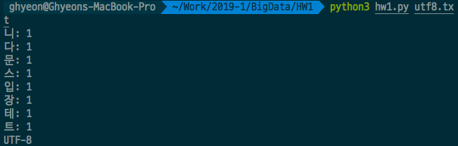
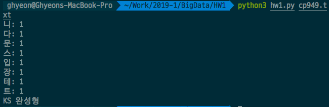
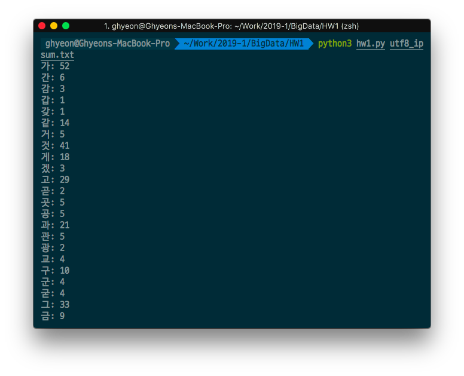
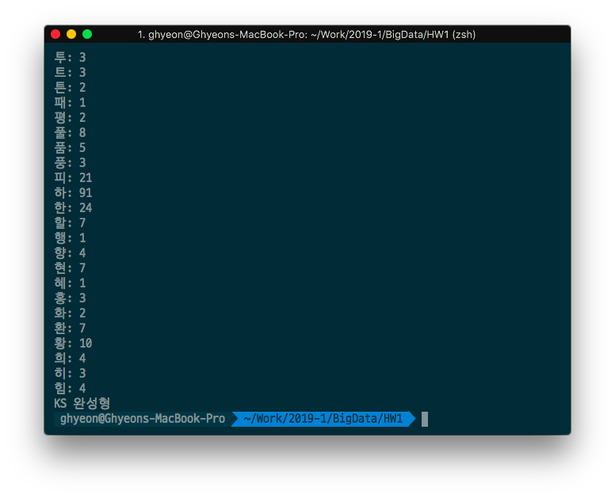

## 빅데이터최신기술 과제 1 - 한글 음절빈도 계산

#### 20171701 정지현

전체 레포지토리 링크: https://github.com/ghyeon0/BigData_Homework/tree/master/HW1

혹시 보고서 형식이 많이 깨진다면 

##### 1. 알고리즘

- 인코딩 구별

  ```python
  def is_utf8(text):
      lst = []
      for each in text:
          if each >= 128:
              lst.append(each)
      for i in range(0, len(lst), 3):
          if lst[i] < 0b11100000:
              return False
      return True
  ```

  - 아스키 코드를 제외한 모든 원소를 리스트에 넣고, 3의 간격으로 전체를 순회하면서 그 원소가 0b11100000 이상인지 검사해서 전체가 0b11100000 이상이면 utf-8로, 하나라도 틀리다면 KS 완성형으로 판정한다.

- KS 완성형인 경우 음절빈도 계산

  ```python
  def if_ks(text):
      first = ""
      second = ""
      idx = 0
      while idx < len(text):
          first = text[idx]
          idx += 1
  
          if first & 0x80:
              second = text[idx]
              idx += 1
  
          # ASCII
          if first < 128:
              freq[first] += 1
          
          if first >= 0xB0 and first <= 0xC8 and second >= 0xA1 and second <= 0xFE:
              hfreq[first - 0xB0][second - 0xA1] += 1
  ```

  - first에 일단 바이트 하나를 받아오고, 아스키 코드라면 freq배열에, 아스키 코드가 아니라면 바이트 하나를 더 받아와서 hfreq 배열에 카운팅한다. KS 완성형은 상위 바이트와 하위 바이트로 구성되기 때문에 위와 같은 방식으로 카운팅할 수 있다.

- UTF-8인 경우 음절빈도 계산

  ```python
  def if_utf8(text):
      first = ""
      second = ""
      third = ""
      idx = 0
      while idx < len(text):
          first = text[idx]
          idx += 1
  
          if first & 0x80:
              second = text[idx]
              idx += 1
              third = text[idx]
              idx += 1
  
          if first < 128:
              freq[first] += 1
          
          if first >= 0xE0 and first <= 0xEF:
              count_idx = ((first & 0x0f) << 12) | ((second & 0x3f) << 6) | (third & 0x3f)
              count_idx -= 0xAC00
              unifreq[count_idx] += 1
  ```

  - KS 완성형과 방법은 비슷하지만 UTF-8은 한글을 표현하는데 3바이트가 필요하므로 아스키 코드가 아닌 경우 3개의 바이트를 받아온다.

- KS 완성형 빈도 출력

  ```python
  def ks_print():
      for i in range(25):
          for j in range(94):
              if hfreq[i][j]:
                  print(bytes([i + 0xB0, j + 0xA1]).decode('cp949') + ":", hfreq[i][j])
      print("KS 완성형")
  ```

  - 전체 범위를 돌면서 하나라도 카운팅된 글자는 "안: 1" 과 같은 방식으로 출력한다.

- UTF-8 빈도 출력

  ```python
  def utf8_print():
      for i in range(11172):
          if unifreq[i]:
              num = i + 0xAC00
              first = num >> 12
              first = 0xE << 4 | first
              second = num >> 6 & 0b111111
              second = 0b10000000 | second
              third = num & 0b111111 | 0b10000000
              print(bytes([first, second, third]).decode("utf-8") + ":", unifreq[i])
      print("UTF-8")
  ```

  - 유니코드 한글 전체 범위를 돌면서 각 글자가 하나라도 카운팅 된 경우 utf-8 인코딩 방식과 같이 나눈 다음 "안: 1"과 같은 방식으로 출력한다.


##### 2. 사용법

```bash
python3 hw1.py {file_name}
```


##### 3. 실행결과

utf8.txt와 cp949.txt 파일은 '테스트 문장입니다.' 문장을 내용으로 하는 인코딩만 다른 파일.

```bash
python3 hw1.py utf8.txt
```



```bash
python3 hw1.py cp949.txt
```




utf8_ipsum.txt와 cp949_ipsum.txt는 [한글입숨][http://hangul.thefron.me/] 을 통해 생성한 내용은 같고 인코딩이 다른 파일.

```bash
python3 hw1.py utf8_ipsum.txt
```



```bash
python3 hw1.py cp949_ipsum.txt
```




##### 4. 전체 소스코드

```python
import sys

# ASCII 카운트
freq = [0 for i in range(128)]
# KS 완성형 카운트
hfreq = [[0 for i in range(94)] for j in range(25)]
# 유니코드 한글 카운트
unifreq = [0 for i in range(11172)]


# 인코딩이 utf-8인지 검증
def is_utf8(text):
    lst = []
    for each in text:
        if each >= 128:
            lst.append(each)
    for i in range(0, len(lst), 3):
        if lst[i] < 0b11100000:
            return False
    return True


# 파일이 KS 완성형인 경우
def if_ks(text):
    first = ""
    second = ""
    idx = 0
    while idx < len(text):
        first = text[idx]
        idx += 1

        if first & 0x80:
            second = text[idx]
            idx += 1

        # ASCII
        if first < 128:
            freq[first] += 1
        
        if first >= 0xB0 and first <= 0xC8 and second >= 0xA1 and second <= 0xFE:
            hfreq[first - 0xB0][second - 0xA1] += 1

    ks_print()


# KS 완성형 빈도 출력
def ks_print():
    for i in range(25):
        for j in range(94):
            if hfreq[i][j]:
                print(bytes([i + 0xB0, j + 0xA1]).decode('cp949') + ":", hfreq[i][j])
    print("KS 완성형")
            

# 파일이 UTF-8 인코딩인 경우
def if_utf8(text):
    first = ""
    second = ""
    third = ""
    idx = 0
    while idx < len(text):
        first = text[idx]
        idx += 1

        if first & 0x80:
            second = text[idx]
            idx += 1
            third = text[idx]
            idx += 1

        if first < 128:
            freq[first] += 1
        
        if first >= 0xE0 and first <= 0xEF:
            count_idx = ((first & 0x0f) << 12) | ((second & 0x3f) << 6) | (third & 0x3f)
            count_idx -= 0xAC00
            unifreq[count_idx] += 1
    
    utf8_print()


# UTF-8 빈도 출력
def utf8_print():
    for i in range(11172):
        if unifreq[i]:
            num = i + 0xAC00
            first = num >> 12
            first = 0xE << 4 | first
            second = num >> 6 & 0b111111
            second = 0b10000000 | second
            third = num & 0b111111 | 0b10000000
            print(bytes([first, second, third]).decode("utf-8") + ":", unifreq[i])
    print("UTF-8")


def main(file_name):
    f = open(file_name, "rb")
    text = f.read()
    f.close()
    utf8_flag = is_utf8(text)
    if utf8_flag:
        if_utf8(text)
    else:
        if_ks(text)


if __name__ == "__main__":
    # 실행할 때 매개변수로 파일명 지정
    if len(sys.argv) == 2:
        file_name = sys.argv[1]
    # 아니면 입력 받음
    else:
        file_name = input("Input File Name: ")
    main(file_name)
```

